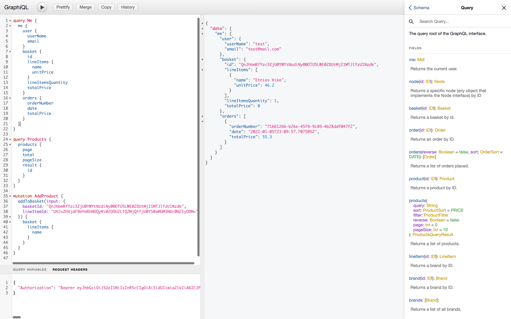

# GraphQL API Gateway Service

The GraphQL API Gateway service is implemented using [Netflix DGS](https://netflix.github.io/dgs/).
When the client sends a request to the gateway, it either calls to an internal microservice and converts the response
accordingly, or it calls multiple microservices, aggregates the results and returns data to the client.

Currently, the GraphQL API gateway doesn't use the Circuit Breaker pattern, but the implementation would be very similar to 
how it's implemented in [Gateway Service](../gateway).

# Test the GraphQL API Gateway Service with GraphiQL
Start the service and open a browser to http://localhost:3001/graphiql. You will see the following screen:

If you want to query or mutate some protected resources, you'll have to add Authorization header:

# Running the GraphQL API Gateway Service
The best way to run the service is with IDE like IntelliJ IDEA or Eclipse. Alternatively, after you build the service,
you can run it with the following command:

    ~ java -jar infrastructure/gql-gateway/target/gql-gateway.jar

Optional profiles:
1. **elk** - to enable ELK logging.
2. **distributed-tracing** - to enable distributed tracing with Sleuth and Zipking.
3. **docker** - used when the service is run with docker.
